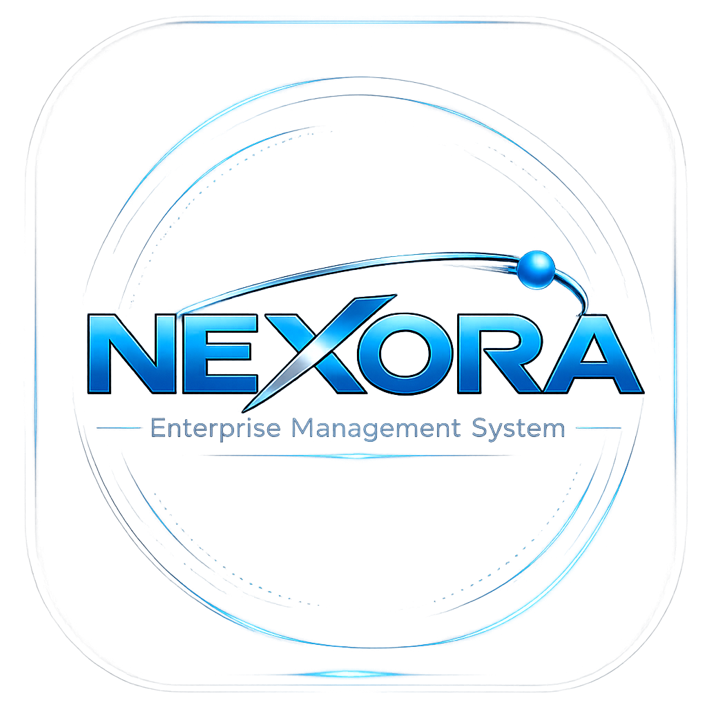

# Nexora — Enterprise Intelligence Platform
<p align="center">
  
</p>
<p align="center">
  <strong>Gestão empresarial, vendas e e-commerce em um único ecossistema.</strong><br>
  ERP modular com IA embarcada · Força de Vendas · E-commerce integrado
</p>
<p align="center">
  
  
  
  
  
</p>
---
## Sobre o Projeto
A **Nexora** é uma plataforma enterprise de gestão empresarial desenvolvida para integrar ERP, Força de Vendas e E-commerce em um único ecossistema inteligente. O projeto nasceu da necessidade de eliminar sistemas desconectados que geram retrabalho, erros e falta de visão estratégica nas empresas.
> "O ecossistema para operar sua empresa do financeiro ao e-commerce."
### Posicionamento
**Nexora Platform** — Enterprise Intelligence Platform
- Não é apenas um ERP: é um ecossistema integrado
- IA embarcada nativa (não é add-on)
- Arquitetura modular (escolha o que precisar)
- 100% Web / Cloud Ready
---
## Produtos
### 1. Nexora EMS ERP
ERP modular completo com IA embarcada para operações complexas.
| Módulo | Descrição |
|--------|-----------|
| Financeiro | Contas a pagar/receber, fluxo de caixa, DRE, conciliação bancária |
| Fiscal | Emissão de NF-e, NFC-e, CT-e, SPED, SEFAZ, apuração automatizada |
| Compras | Requisições, cotações, ordens de compra e gestão de fornecedores |
| Estoque | Controle de entrada/saída, rastreabilidade, inventário e WMS |
| Produção | Ordens de produção, BOM, apontamentos e controle de qualidade |
| RH | Folha de pagamento, ponto eletrônico e benefícios |
| Logística | Expedição, rotas e integração com transportadoras |
| Vendas | Pedidos, propostas, CRM básico e metas de performance |
| IA Suporte | Assistente contextual com RAG, Tools e insights preditivos |
### 2. Força de Vendas Nexora *(Em desenvolvimento)*
Dashboard comercial completo para equipes externas de vendas.
| Módulo | Descrição |
|--------|-----------|
| Dashboard Comercial | Visão consolidada de performance da equipe de vendas |
| Clientes | Gestão completa da carteira de clientes |
| Prospects | Pipeline de novos clientes e oportunidades |
| Agenda de Visitas | Planejamento e controle de visitas comerciais |
| Pedidos | Emissão e acompanhamento de pedidos em campo |
| Catálogo | Catálogo digital com preços e disponibilidade em tempo real |
| Metas e Comissão | Acompanhamento de metas e cálculo de comissões |
| CRM Oportunidades | Gestão de oportunidades e funil de vendas |
| Promoções | Campanhas e promoções disponíveis para a força de vendas |
| Roteirização | Planejamento inteligente de rotas de visita |
| Financeiro do Cliente | Situação financeira e limite de crédito do cliente |
| Relatórios | Relatórios de performance comercial |
| Assistente IA | IA contextual para suporte à equipe de vendas |
### 3. Nexora E-commerce
Hub omnichannel integrado diretamente ao ERP.
| Recurso | Descrição |
|---------|-----------|
| Catálogo sincronizado | Produtos gerenciados no ERP, publicados automaticamente |
| Estoque em tempo real | Nunca venda o que não tem |
| Pedidos no ERP | Todo pedido online entra direto no fluxo de vendas |
| Pricing integrado | Tabelas de preço e promoções centralizadas |
---
## Diferenciais Competitivos
```
              Nexora     ERP comum
Financeiro      ✓           ✓
Produção        ✓           -
IA nativa       ✓           -
Força de Vendas ✓           -
E-commerce      ✓           -
Fiscal auto.    ✓           ✓
Logística       ✓           -
100% Web        ✓           -
```
---
## Stack Tecnológica
| Camada | Tecnologia |
|--------|-----------|
| Backend | PHP 8.2+ / Laravel 12.x |
| Frontend | Blade Templates + Tailwind CSS 4.x |
| Build | Vite 8.x |
| Banco de Dados | MySQL 8.0 |
| Fontes | Space Grotesk (display) + Inter (body) |
| Ícones | Heroicons (SVG inline) |
---
## Design System
### Paleta de Cores
| Token | Valor | Uso |
|-------|-------|-----|
| `--color-primary` | `#2563EB` | Botões, links, destaques |
| `--color-electric` | `#00A8FF` | Hover, efeitos |
| `--color-cyan` | `#38BDF8` | Glow, IA, accent |
| `--color-navy` | `#0B1020` | Seções alternadas |
| `--color-bg` | `#020617` | Background principal |
| `--color-surface` | `#0F172A` | Cards, surfaces |
| `--color-graphite` | `#1E293B` | Bordas, separadores |
| `--color-silver` | `#C7D2E3` | Textos secundários |
### Gradientes
```css
/* Gradiente principal */
linear-gradient(135deg, #2563EB 0%, #0D6EFD 45%, #38BDF8 100%)
/* Gradiente hero */
linear-gradient(135deg, #020617, #0B1020, #1E3A8A)
```
### Componentes
- **Glass Cards** — `backdrop-filter: blur(18px)` com borda cyan translúcida
- **Botão Primary** — Gradiente azul com glow `box-shadow: 0 0 20px rgba(56,189,248,.25)`
- **Botão Secondary** — Outline com borda cyan
- **Badges** — Pill rounded com background translúcido
### Animações
| Classe | Efeito |
|--------|--------|
| `.float-card` | Cards flutuando (translateY loop) |
| `.reveal` | Scroll reveal com fade + slide up |
| `.pulse-glow` | Glow pulsante nos CTAs |
| `[data-target]` | Contadores animados |
---
## Estrutura do Projeto
```
Nexora/
├── app/
│   └── Http/
│       └── Controllers/
│           └── PageController.php     # Controller principal
├── resources/
│   ├── css/
│   │   └── app.css                    # Design system + Tailwind v4
│   ├── js/
│   │   └── app.js                     # Animações e interações
│   └── views/
│       ├── layouts/
│       │   └── app.blade.php          # Layout base
│       ├── components/
│       │   ├── navbar.blade.php       # Navbar fixa com glassmorphism
│       │   └── footer.blade.php       # Footer completo
│       ├── home.blade.php             # Homepage (6 seções)
│       ├── erp.blade.php              # Página ERP
│       ├── fdv.blade.php              # Força de Vendas (waitlist)
│       ├── ecommerce.blade.php        # E-commerce
│       ├── sobre.blade.php            # Sobre a empresa
│       ├── demo.blade.php             # Formulário de demo (lead gen)
│       └── contato.blade.php          # Formulário de contato
├── routes/
│   └── web.php                        # Todas as rotas
├── public/
│   └── images/
│       └── LogoNexora.png             # Logo da marca
└── docs/
    └── design/
        └── LogoNexora.png             # Logo original
```
---
## Páginas
| Rota | View | Descrição |
|------|------|-----------|
| `GET /` | `home.blade.php` | Homepage com hero, problema, ecossistema, módulos e CTA |
| `GET /erp` | `erp.blade.php` | Página comercial do ERP com grid de 9 módulos |
| `GET /fdv` | `fdv.blade.php` | Força de Vendas — waitlist com 13 módulos listados |
| `GET /ecommerce` | `ecommerce.blade.php` | Hub omnichannel E-commerce |
| `GET /sobre` | `sobre.blade.php` | Missão e valores da empresa |
| `GET /demo` | `demo.blade.php` | Formulário de lead gen para demonstração |
| `GET /contato` | `contato.blade.php` | Formulário de contato |
| `POST /demo` | — | Processa solicitação de demo |
| `POST /contato` | — | Processa mensagem de contato |
---
## Instalação e Execução
### Pré-requisitos
- PHP 8.2+
- Composer
- Node.js 20+
- MySQL 8.0
### Passo a Passo
```bash
# 1. Clonar o repositório
git clone <repo-url>
cd Nexora
# 2. Instalar dependências PHP
composer install
# 3. Instalar dependências JS
npm install
# 4. Configurar variáveis de ambiente
cp .env.example .env
php artisan key:generate
# 5. Configurar banco de dados no .env
DB_CONNECTION=mysql
DB_HOST=127.0.0.1
DB_PORT=3306
DB_DATABASE=NexoraWebSite
DB_USERNAME=seu_usuario
DB_PASSWORD=sua_senha
# 6. Criar banco e rodar migrations
mysql -u root -e "CREATE DATABASE NexoraWebSite CHARACTER SET utf8mb4 COLLATE utf8mb4_unicode_ci;"
php artisan migrate
# 7. Compilar assets
npm run build
# 8. Iniciar servidor
php artisan serve
```
O site estará disponível em: **http://127.0.0.1:8000**
### Modo Desenvolvimento (hot reload)
```bash
# Terminal 1
php artisan serve
# Terminal 2
npm run dev
```
---
## Roadmap
### Sprint 1 — Concluído ✅
- [x] Homepage institucional
- [x] Página ERP
- [x] Força de Vendas (waitlist)
- [x] E-commerce
- [x] Sobre
- [x] Demo (lead gen)
- [x] Contato
### Sprint 2 — Em planejamento
- [ ] Blog (SEO)
- [ ] Cluster de conteúdo ERP
- [ ] Otimização SEO On-page
- [ ] Integração CRM/Webhook
### Sprint 3 — Futuro
- [ ] Simulador interativo
- [ ] Calculadora de ROI
- [ ] Pricing page
- [ ] Área do cliente
- [ ] Status page
- [ ] Documentação pública
---
## Contribuição
Projeto interno Nexora. Para contribuições ou sugestões, entre em contato com a equipe de desenvolvimento.
---
## Licença
Propriedade da **Nexora**. Todos os direitos reservados © 2026.
